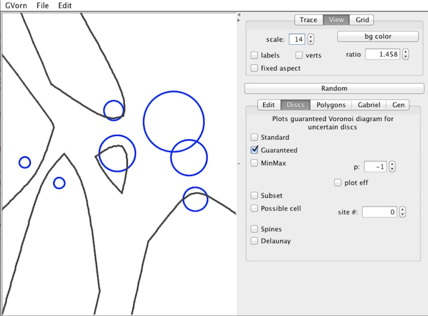

Guaranteed Voronoi Diagrams
===========

This Java program was used to develop and demonstrate the algorithms 
discussed in Chapter 2 of my [Ph.D. dissertation](https://circle.ubc.ca/handle/2429/38084).

The program can be run as an application; its main class is gvorn.Main.class.
It can also be run as an applet, by loading the page "Applet.html" within a browser
(or from the command line: "appletviewer Applet.html").

Some of this research was presented at the 2008 Canadian Conference on Computational Geometry.
The [cccg2008 directory](cccg2008) contains the presented paper and its accompanying slides.

